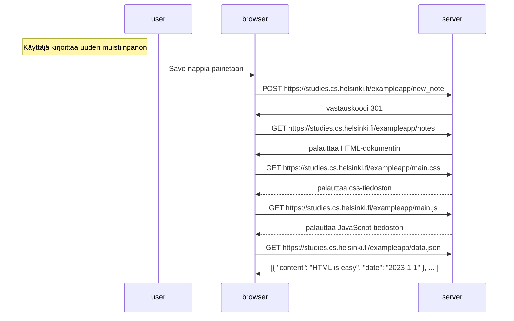

# Tehtävä 0.4

```mermaid
sequenceDiagram
    participant user
    participant browser
    participant server
    
    Note left of user: Käyttäjä kirjoittaa uuden muistiinpanon
    user->>browser: Save-nappia painetaan
    browser->>server: POST https://studies.cs.helsinki.fi/exampleapp/new_note
    server->>browser: vastauskoodi 301
    browser->>server: GET https://studies.cs.helsinki.fi/exampleapp/notes
    server->>browser: palauttaa HTML-dokumentin
    
    browser->>server: GET https://studies.cs.helsinki.fi/exampleapp/main.css
    server-->>browser: palauttaa css-tiedoston
    
    browser->>server: GET https://studies.cs.helsinki.fi/exampleapp/main.js
    server-->>browser: palauttaa JavaScript-tiedoston
    
    browser->>server: GET https://studies.cs.helsinki.fi/exampleapp/data.json
    server-->>browser: [{ "content": "HTML is easy", "date": "2023-1-1" }, ... ]

```
